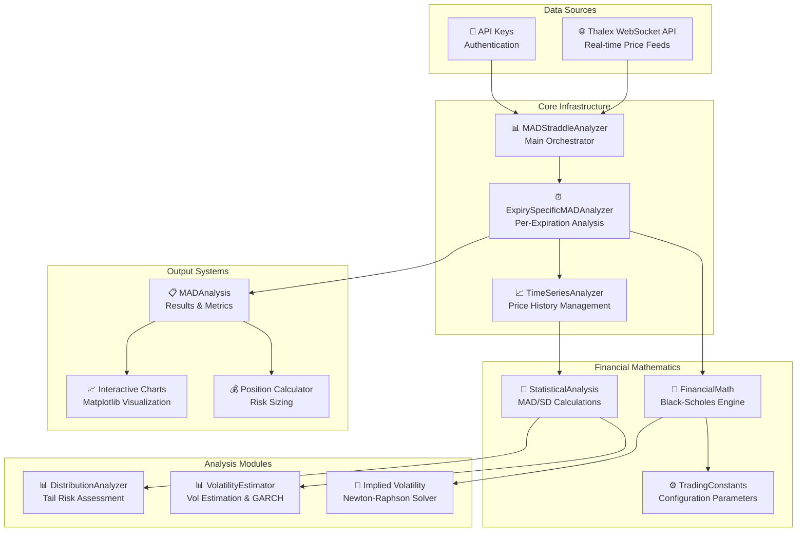
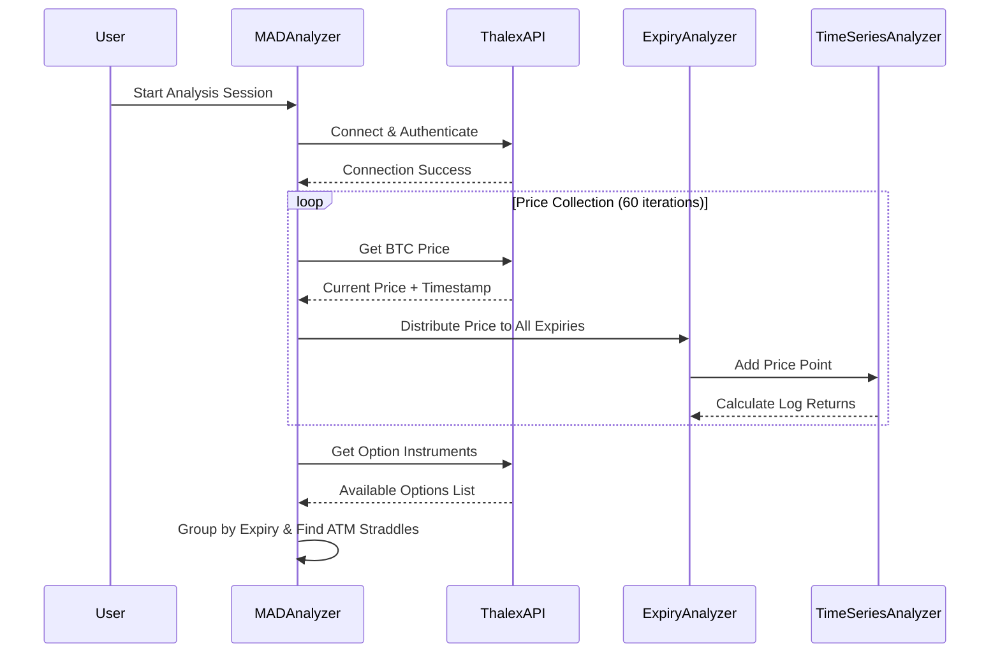
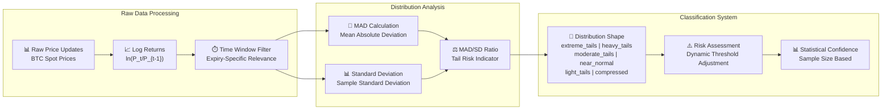
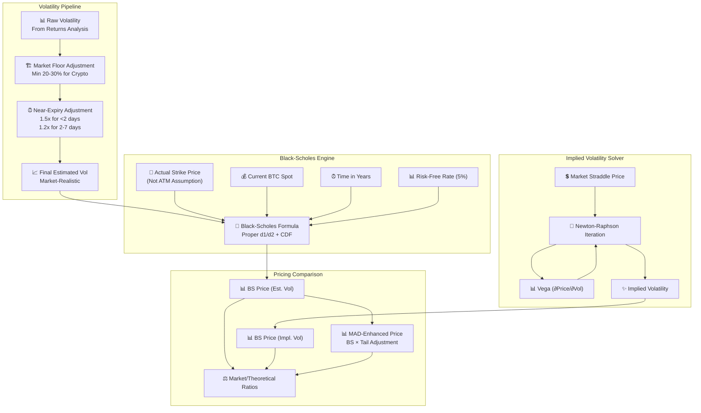

# Enhanced MAD Straddle Analyzer - Architecture & Flow Diagram

## 🏗️ System Architecture Overview



## 🔄 Data Flow Process

### Phase 1: Data Collection & Initialization



### Phase 2: Enhanced Statistical Analysis



### Phase 3: Enhanced Financial Pricing



## 📊 Data Structures & Key Classes

### Core Data Models

```python
# Simplified class structure for understanding
class SimpleOption:
    name: str           # "BTC-01AUG25-118000-C"
    strike: float       # 118000.0
    option_type: str    # "call" | "put"  
    expiry_ts: int      # Unix timestamp
    mark_price: float   # Market price

class MADAnalysis:
    # Statistical metrics
    mad: float                    # Mean Absolute Deviation ($)
    std_dev: float               # Standard Deviation ($)
    mad_sd_ratio: float          # Tail risk indicator (0.0-1.0)
    
    # Pricing comparisons
    actual_straddle: float       # Market price
    theoretical_straddle: float  # MAD-enhanced price
    bs_theoretical: float        # Black-Scholes (estimated vol)
    bs_theoretical_implied: float # Black-Scholes (implied vol)
    
    # Volatility metrics
    estimated_vol: float         # Our volatility estimate
    bs_implied_vol: float       # Market implied volatility
    
    # Efficiency ratios
    efficiency_ratio: float      # Market/MAD-Enhanced
    bs_efficiency_ratio: float   # Market/BS-Estimated  
    bs_implied_efficiency_ratio: float # Market/BS-Implied (≈1.0)

class ExpirationData:
    expiry_date: str            # "2025-08-01"
    days_to_expiry: float       # 1.6
    atm_call: SimpleOption      # Call option
    atm_put: SimpleOption       # Put option
    mad_analysis: MADAnalysis   # Analysis results
```

## 🔄 Processing Logic Flow

### 1. **Data Collection Phase**
```
📡 WebSocket Connection
├── 🔐 JWT Authentication
├── 📊 60 Price Updates (0.5s intervals)
├── 📋 Option Instruments List
└── 🎯 ATM Straddle Identification
```

### 2. **Statistical Analysis Phase**
```
📈 Time Series Processing
├── 📊 Log Returns Calculation
├── ⏱️ Time Window Filtering
├── 📐 MAD/SD Computation
├── 🎯 Distribution Classification
└── ⚠️ Risk Assessment
```

### 3. **Financial Pricing Phase**
```
🧮 Volatility Processing
├── 🏗️ Market Floor Application (20-30%)
├── ⏰ Near-Expiry Adjustments (1.2-1.5x)
├── 🎯 Black-Scholes Calculation (Actual Strike)
├── ✨ Implied Volatility Solving
└── 📊 Multi-Model Price Comparison
```

### 4. **Analysis & Output Phase**
```
📋 Results Generation
├── ⚖️ Efficiency Ratio Calculations
├── 🎯 Dynamic Threshold Assessment
├── ⚠️ Risk Warning Generation  
├── 📈 Interactive Visualization
└── 💰 Position Sizing Integration
```

## 🎯 Key Algorithmic Components

### **Newton-Raphson Implied Volatility Solver**
```python
# Iterative solver for market-implied volatility
for iteration in range(max_iterations):
    bs_price = black_scholes_straddle(spot, strike, time, rate, vol)
    vega = calculate_straddle_vega(spot, strike, time, rate, vol)
    vol_new = vol - (bs_price - market_price) / vega
    if abs(vol_new - vol) < tolerance:
        return vol_new  # Converged solution
```

### **Dynamic Tail Risk Thresholds**
```python
# MAD/SD ratio-based threshold adjustment
def get_tail_adjusted_thresholds(mad_sd_ratio):
    if mad_sd_ratio < 0.50:    # Extreme tails
        return (0.65, 1.50)    # Very conservative
    elif mad_sd_ratio < 0.65:  # Heavy tails  
        return (0.70, 1.40)    # Conservative
    elif mad_sd_ratio < 0.73:  # Moderate tails
        return (0.75, 1.30)    # Moderate
    else:                      # Near normal
        return (0.80, 1.25)    # Standard
```

### **Enhanced Volatility Estimation**
```python
# Multi-stage volatility processing
raw_vol = estimate_from_returns(price_data)
floor_adjusted = max(raw_vol, min_vol_floor)  # 20-30% floor
if days_to_expiry < 2.0:
    final_vol = floor_adjusted * 1.5          # Near-expiry boost
elif days_to_expiry < 7.0:
    final_vol = floor_adjusted * 1.2          # Short-term boost  
else:
    final_vol = floor_adjusted                # Standard
```

## 📈 Output & Visualization

### **Enhanced Analysis Dashboard**
- 📊 **Real-time pricing comparison** (4 different models)
- 📈 **Interactive matplotlib charts** with breakeven analysis  
- ⚖️ **Efficiency ratio tracking** across multiple expiries
- ⚠️ **Dynamic risk warnings** based on tail risk
- 💰 **Integrated position sizing** for portfolio management

### **Professional Trading Insights**
- ✅ **Market efficiency assessment** (Fair/Over/Under priced)
- 📊 **Implied vs estimated volatility** comparison
- 🎯 **Distribution shape analysis** with confidence levels
- ⏰ **Time decay and gamma risk** warnings for near expiry
- 📋 **Comprehensive logging** for audit trails

---

## 🚀 **Technical Advantages**

1. **✅ Professional-Grade Accuracy**: Proper Black-Scholes with actual parameters
2. **✅ Market-Reality Integration**: Implied volatility solving and comparison  
3. **✅ Statistical Rigor**: Genuine MAD analysis without artificial manipulation
4. **✅ Dynamic Risk Assessment**: Tail-risk adjusted thresholds and warnings
5. **✅ Production Ready**: Comprehensive error handling and validation
6. **✅ Extensible Architecture**: Modular design for easy enhancement

This enhanced system transforms your original B+ implementation into a professional **A-grade options analysis platform** suitable for institutional trading environments! 🎯